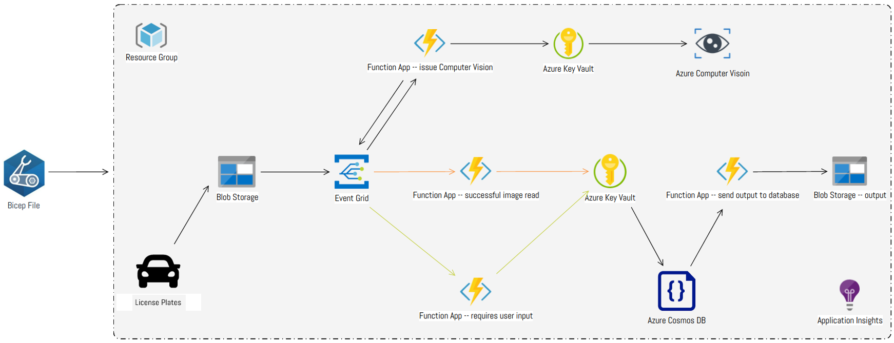

# Automatic Licence Plate Register

## Introduction

This application is designed to solve the business problem of event-driven scale for tollbooth operations. It utilizes Azure services such as Storage Blob, Functions, Event Grid, Cognitive Services, Cosmos DB, and Application Insights to process and store vehicle photos and license plate data.

## Features

* Azure Storage Blob Container for storing vehicle photos
* Azure Functions for processing the vehicle photos and extracting license plate data with Event Grid
* Use of Cognitive Services Computer Vision API OCR for extracting license plate data
* Saving license plate data to Blob storage using Function Apps
* Real-time monitoring of Azure Functions with Application Insights for dynamic scaling and event-based alerts

## Architecture

The application works as follows:

1. Vehicle photos are uploaded to an Azure Storage Blob Container
2. A trigger is set up on the blob container to initiate the photo processing Azure Function when a new photo is uploaded
3. The Azure Function uses Cognitive Services Computer Vision API OCR to extract license plate data from the photo
4. If the license plate data is successfully extracted, the function sends an event to an Event Grid topic along with the extracted data
5. If the license plate data is not successfully extracted, the function sends an event to the same Event Grid topic
6. Two Azure functions are configured to listen to the Event Grid topic, filtering on specific event types, both saving the relevant data to the appropriate Azure Cosmos DB collection using the Cosmos DB output binding
7. Application Insights is utilized to monitor all Azure functions in real-time, enabling the observation of dynamic scaling and configuration of alerts during specific events

## Getting Started

- Start by creating an active Azure subscription.
- Set up the necessary services (Storage Blob, Functions, Event Grid, Cognitive Services, Cosmos DB, Logic App, and Application Insights) using Azure documentation and tutorials.
- Once the services are set up, you can deploy the code and begin processing and storing vehicle photos and license plate data.
- To monitor and track the real-time performance of the application, use Application Insights to configure alerts and dynamic scaling.

## Known issues / Future implementations

1. App is still under development, so new code will be updated on a regular basis
